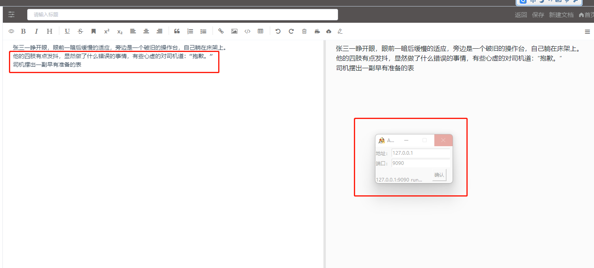
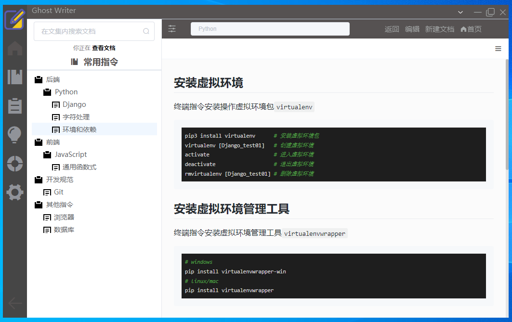

# GhostWriter
[](https://github.com/MarkSamle/GhostWriter) [](README.md)

---

##  1. Document Description 

Welcome to [Ghost Writer]((https://github.com/MarkSamle/GhostWriter)) !  <br>

Ghost Writer is an offline management application for personal notes and documents developed with reference to [觅道(MrDoc)](https://github.com/zmister2016/MrDoc).  <br> 

Is a pure front-end project, the use of sqlite local database, in addition to self-editing to use external images, external videos, external links and other resources, as well as OCR recognition interface, registration, login, editing and other functions do not use the network, data stored in the application's local resource folder, fully guaranteed data privacy, private.<br>

Default administrator account `admin` Password `admin123..` 

## 2. Other Description
### 2.1 Sql.js

[sql.js](https://github.com/sql-js/sql.js) is hosted on [npm](https://www.npmjs.org/package/sql.js). You can install it by running `npm install sql.js`. Alternatively, you can download `sql-wasm.js` and `sql-wasm.wasm` to implement the function. 


#### 2.2 Read database from disk 
```
var fs = require('fs');
var initSqlJs = require('sql-wasm.js');
var filebuffer = fs.readFileSync('test.sqlite');
initSqlJs().then(function(SQL){
// Load the db
var db = new SQL.Database(filebuffer);
});
```

#### 2.3 Write the database to disk 
You need to convert the result of `db.export` to `buffer`
```
var fs = require("fs");
// [...] (create the database)
var data = db.export();
var buffer = new Buffer(data);
fs.writeFileSync("filename.sqlite", buffer);
```

## 3. Local Build 
### 3.1 Installing Dependencies 
```
npm install
cnpm install
```

### 3.2 Install-app-deps Error Handling (Negligible) 

It is recommended to use the command `electron-builder install-app-deps` before packaging with `electron-builder`.

This command is used to compile the native module for the node version corresponding to the `electron` program to be packaged, so as to achieve module runtime matching.

In fact, the `node-gyp` knowledge is still used inside install-app-deps. 

If an error occurs during the install phase, you can first put `"postinstall":"electron-builder install-app-deps",`and`"postuninstall":"electron-builder install-app-deps"`delete and execute. 


### 3.3 Node-gyp Error Handling (Negligible) 

When `cnpm install`/`npm install`, an error is reported: `RunScriptError: Run "C:\Windows\system32\cmd.exe /d /s /c node-gyp rebuild"` 

Run powershell with administrator privileges, install `cnpm install --global --production windows-build-tools`, and add `C:\Users\username\.windows-build-tools\python27` to the configuration environment variable path 

### 3.4 Run
```
npm run dev
```

### 3.5 Build
```
npm run electron:build
```
#### 3.5.1 Build Error Handling
 When you are prompted `cannot find module fs/promises`, find the dependent file according to the error location, replace all `require("fs/promises")` with `require("fs").promises`, and then package. 

#### 3.5.2 Or upgrade node
```
# The first step to clean up the npm cache: 
npm cache clean -f 
# Step 2 Run the npm installer 
npm -g install n 
# Step 3 Run n stable(install the latest stable version) 
n stable 
```

#### 3.5.3 Or reduce cnpm 

``` 
# Step 1 Remove the installed CNPM version 
npm uninstall -g cnpm 
# Step 2: Install a lower version of cnpm 
npm install cnpm@7.1.0 -g --registry=https://registry.npm.taobao.org 
``` 

## 4. Use
### 4.1 F12
`Ctrl + F12`  Open the console 
### 4.2 Show





## 5. 感谢
[Vue](https://github.com/vuejs/vue)<br>
[Electron](https://github.com/electron/electron)<br>
[electron-vue](https://github.com/SimulatedGREG/electron-vue)<br>
[sql.js](https://github.com/sql-js/sql.js)<br>
[TrWebOCR](https://github.com/alisen39/TrWebOCR)<br>