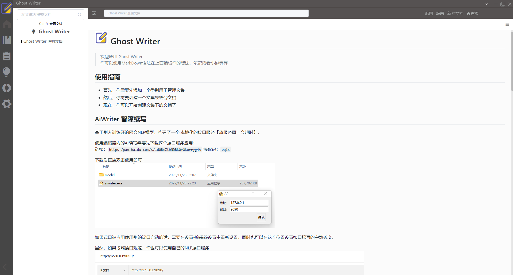
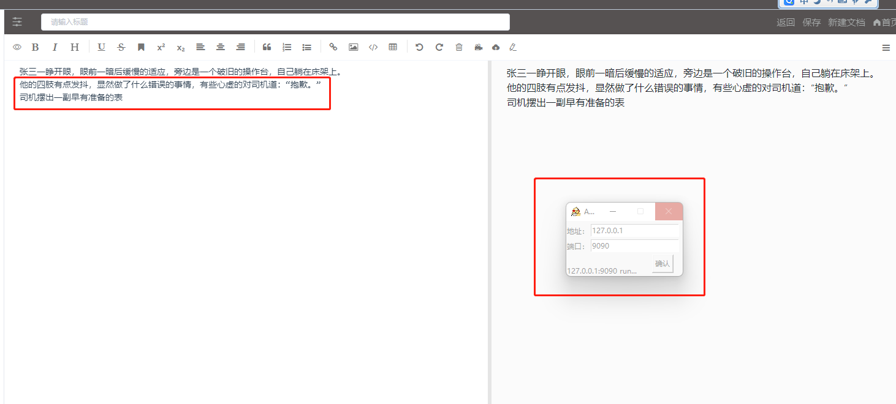
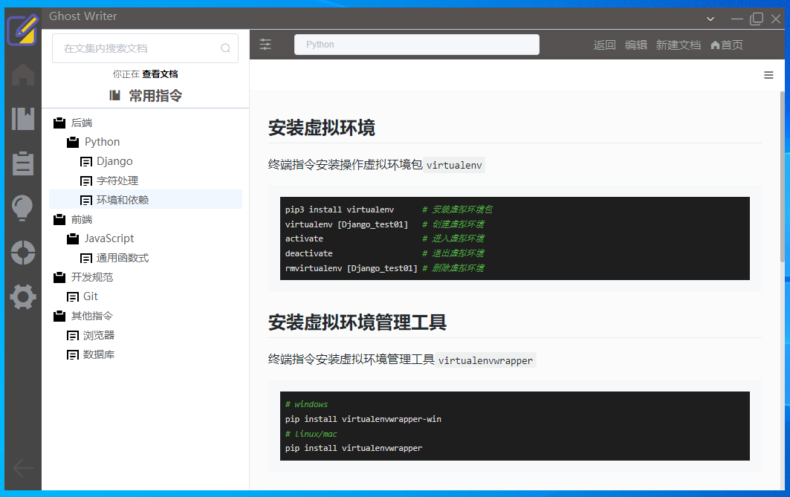

# GhostWriter
[](https://github.com/MarkSamle/GhostWriter) [](README-EN.md)

---

## 一、说明
&nbsp;&nbsp;&nbsp;&nbsp;&nbsp;&nbsp;&nbsp;&nbsp;
欢迎使用 [Ghost Writer]((https://github.com/MarkSamle/GhostWriter)) ！<br>
&nbsp;&nbsp;&nbsp;&nbsp;&nbsp;&nbsp;&nbsp;&nbsp;
Ghost Writer 是一款参照 [觅道(MrDoc)](https://github.com/zmister2016/MrDoc) 开发的个人笔记、文档离线管理应用。<br>
&nbsp;&nbsp;&nbsp;&nbsp;&nbsp;&nbsp;&nbsp;&nbsp;
是一个纯前端项目，使用了sqlite本地数据库，除自行编辑使用到的外部图片、外部视频、外部链接等资源、以及OCR识别接口外，注册、登录、编辑等功能均不使用网络，数据存储在该应用本地的资源夹内，完全的保证了数据的隐私、私有。默认管理员账号 `admin` 密码 `admin123..`

## 二、其他
### 2.1 Sql.js
在 node.js 中使用[sql.js](https://github.com/sql-js/sql.js) 已经托管在 [npm](https://www.npmjs.org/package/sql.js) ,你只需运行 `npm install sql.js` 就能安装。另外，你也可以选择下载 `sql-wasm.js` 和 `sql-wasm.wasm` 来实现功能

#### 2.2 从磁盘读取数据库
```
var fs = require('fs');
var initSqlJs = require('sql-wasm.js');
var filebuffer = fs.readFileSync('test.sqlite');
initSqlJs().then(function(SQL){
// Load the db
var db = new SQL.Database(filebuffer);
});
```

#### 2.3 将数据库写入磁盘
你需要将 db.export 的结果转换为 buffer
```
var fs = require("fs");
// [...] (create the database)
var data = db.export();
var buffer = new Buffer(data);
fs.writeFileSync("filename.sqlite", buffer);
```

## 三、本地搭建
### 3.1 安装依赖
```
npm install
cnpm install
```
### 3.2 install-app-deps报错处理(可忽略)
`electron-builder`进行打包的时候，会建议你在此之前使用`electron-builder install-app-deps`的命令。该命令的作用就是针对即将打包的`electron`程序对应的node版本进行原生模块的编译工作，以达到模块运行时匹配。实际上，install-app-deps内部依然使用了`node-gyp`相关知识。
如果install环节出现报错，可以先把`"postinstall": "electron-builder install-app-deps",`和`"postuninstall": "electron-builder install-app-deps"`删除再执行。

### 3.3 node-gyp报错处理(可忽略)
`cnpm install`/`npm install`时，报错：`RunScriptError: Run "C:\Windows\system32\cmd.exe /d /s /c node-gyp rebuild"`
管理员权限运行powershell，安装`cnpm install --global --production windows-build-tools`，配置环境变量path增加`C:\Users\username\.windows-build-tools\python27`

### 3.4 运行
```
npm run dev
```

### 3.5 打包
```
npm run electron:build
```
#### 3.5.1 打包异常处理
提示`cannot find module fs/promises`时，按报错位置找到依赖文件，把`require("fs/promises")`全部替换为`require("fs").promises`再打包

#### 3.5.2 或者升级node
```
# 第一步清理npm缓存：
npm cache clean -f
# 第二步运行npm安装工具
npm -g install n
# 第三步运行n stable(安装最新稳定版本)
n stable
```

#### 3.5.3 或者降低cnpm
```
# 第一步删除已安装的cnpm版本
npm uninstall -g cnpm
# 第二步安装低版本cnpm
npm install cnpm@7.1.0 -g --registry=https://registry.npm.taobao.org
```

## 四、使用
### 4.1 F12
`Ctrl + F12` 打开控制台
### 4.2 展示





## 五、感谢
[Vue](https://github.com/vuejs/vue)<br>
[Electron](https://github.com/electron/electron)<br>
[electron-vue](https://github.com/SimulatedGREG/electron-vue)<br>
[sql.js](https://github.com/sql-js/sql.js)<br>
[TrWebOCR](https://github.com/alisen39/TrWebOCR)<br>